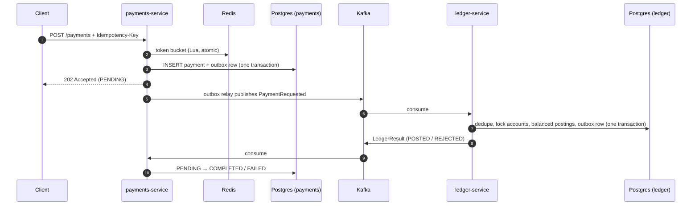

# Ledgerline

**An event-driven payments platform with a double-entry ledger.** Built with Java 21, Spring Boot, Kafka, PostgreSQL and Redis. It never loses, duplicates or invents money, even when clients retry, messages are redelivered, or services crash mid-request.


Every push runs unit and integration tests against real Postgres, Kafka and Redis containers. It then starts the whole system and runs end-to-end checks and a k6 load test. Finally it proves the books still balance after every payment has settled. The load-test numbers are published on each CI run's summary page.

## How a payment flows



## What makes it correct

| Problem | Technique | Where |
| --- | --- | --- |
| Client retries a timed-out request and gets charged twice | **Idempotency keys** with a request fingerprint: same key + same body returns the original payment; same key + different body → 422. Concurrent duplicates race on a unique index. | `PaymentService`, `RequestHasher` |
| Payment saved but the event is lost (crash, Kafka down) | **Transactional outbox**: the event row commits with the payment; a relay publishes it with `FOR UPDATE SKIP LOCKED`, so several replicas can relay safely | `outbox/` |
| Kafka redelivers a message and money moves twice | **Effectively-once consumer**: a `processed_events` row in the same transaction as the postings, plus a unique `payment_id` on journal entries | `LedgerService` |
| Money created or destroyed by a bug | **Double-entry bookkeeping**: every entry's postings sum to zero; opening balances are funded from a treasury account; `/ledger/verify` proves sum = 0 and balance = Σ postings | `DoubleEntry`, `LedgerVerifier` |
| Two transfers race and overdraw an account, or deadlock | **Pessimistic row locks taken in a fixed order** (by account id), plus a database `CHECK` that customer balances can't go negative | `AccountRepository.lockAllOrdered` |
| A poison message blocks a partition forever | **Retries with back-off, then a dead-letter topic**; unparseable messages skip retries | `KafkaConfig` |
| One client floods the API | **Distributed token-bucket rate limiter** in Redis (one atomic Lua script, Redis clock), `429` + `Retry-After` | `ratelimit/` |
| Floating-point rounding errors | Amounts are `long` **minor units** (cents), with overflow checks | everywhere |

## Tech stack

Java 21 (records, virtual threads) · Spring Boot 3.5 · Spring Kafka · Spring Data JPA / Hibernate · Flyway · PostgreSQL 16 · Apache Kafka 3.9 (KRaft) · Redis 7 · Micrometer + Prometheus · Testcontainers · JUnit 5 · k6 · Docker Compose · Kubernetes (Deployments, HPA, PDBs, probes) · GitHub Actions (CI + image publishing to GHCR)

## Run it

You need Docker. To run the tests locally you also need JDK 21 and Maven.

```bash
docker compose up --build -d     # Postgres, Kafka, Redis, both services, Prometheus
bash scripts/e2e.sh              # guided end-to-end walkthrough with checks
```

Try it by hand:

```bash
# open two accounts (amounts in cents)
curl -s -X POST localhost:8082/api/v1/accounts -H 'Content-Type: application/json' \
  -d '{"ownerName":"alice","currency":"USD","openingBalanceMinor":10000}'
curl -s -X POST localhost:8082/api/v1/accounts -H 'Content-Type: application/json' \
  -d '{"ownerName":"bob","currency":"USD","openingBalanceMinor":0}'

# pay (run it twice with the same key: you get the same payment back, charged once)
curl -s -X POST localhost:8081/api/v1/payments -H 'Content-Type: application/json' \
  -H 'Idempotency-Key: order-123' \
  -d '{"payerAccountId":"<alice>","payeeAccountId":"<bob>","amountMinor":2500,"currency":"USD"}'

curl -s localhost:8081/api/v1/payments/<payment-id>    # PENDING -> COMPLETED
curl -s localhost:8082/api/v1/ledger/verify            # {"consistent":true,...}
```

Load test: `docker run --rm -i --network host grafana/k6 run - < loadtest/payments.js`

Tests: `cd payments-service && mvn verify` (same for `ledger-service`). Docker must be running for Testcontainers.

## API

| Service | Endpoint | Purpose |
| --- | --- | --- |
| payments :8081 | `POST /api/v1/payments` | Create a payment (`Idempotency-Key` header required, `X-Client-Id` for rate limiting) |
| | `GET /api/v1/payments/{id}` | Payment status |
| | `GET /api/v1/payments/stats` | Count by status |
| ledger :8082 | `POST /api/v1/accounts` | Open an account with an opening balance |
| | `GET /api/v1/accounts/{id}` · `/postings` | Balance and posting history |
| | `GET /api/v1/ledger/verify` | Prove the ledger's invariants |
| both | `/actuator/health/{liveness,readiness}` · `/actuator/prometheus` | Kubernetes probes and metrics |

## Design decisions and trade-offs

- **Async API (202 Accepted).** The payment API stays fast and available even if the ledger is slow or down. Clients poll for the final state. The cost is eventual consistency instead of an immediate answer.
- **Outbox over dual writes.** Writing to the DB and then to Kafka can fail between the two writes. The outbox costs one table and a polling relay (about 100 ms of extra latency). Change-data capture (Debezium) would remove the polling.
- **At-least-once delivery + idempotent consumers.** This is simpler and more robust than Kafka transactions across a database.
- **Pessimistic locks for balances.** Contention is per account and short-lived. Locking in a fixed order prevents deadlocks. Very hot accounts would need sharded sub-accounts or batching.
- **Rate limiter fails open.** If Redis is down, payments are still accepted, trading abuse protection for availability. A payments product might choose to fail closed instead.
- **Database per service.** Each service owns its schema, and they integrate only through events.

## Deploying to Kubernetes

`k8s/` has Deployments with readiness and liveness probes, resource limits, rolling updates with zero unavailable pods, a HorizontalPodAutoscaler and PodDisruptionBudgets. Postgres, Kafka and Redis are expected to be managed services (e.g. Amazon RDS, MSK, ElastiCache). CI validates the manifests and publishes images to GitHub Container Registry on every push to `main`.

## Roadmap

- Terraform for AWS (EKS + RDS + MSK + ElastiCache)
- OpenTelemetry distributed tracing across the Kafka hop
- Multi-currency transfers with FX journal entries
- Debezium CDC instead of the polling outbox relay

## License

MIT
